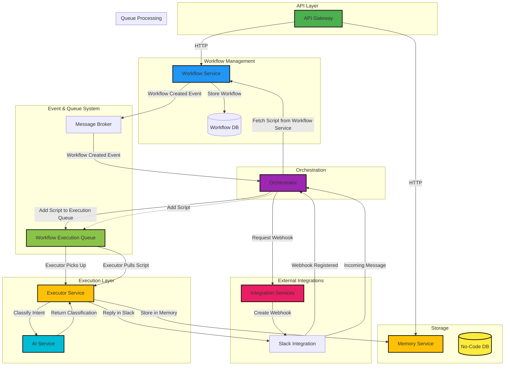

FlowOps lets you define, automate, and run fully or semi-agentic workflows using simple Python scripts.
It’s LLM-native, meaning your agents can think, decide, and take action on their own—or they can be semi-agentic by letting you define some of their decision-making.

# 💪 Why FlowOps? 
🔹 Write workflows in simple Python scripts – Infinite flexibility, no restrictive UI.

🔹 LLM-native – Workflows are built around LLMs that can decide actions dynamically.

🔹 No-Code DB for AI Agents – Store & retrieve structured data effortlessly.

🔹 Knowledge Base Integration – Use docs, FAQs, URLs, and more to supercharge your agents.

🔹 Event-Driven Execution – Agents respond instantly to messages, triggers, or APIs.

🔹 Open-Source & Extensible – Modify, contribute, and expand however you need.

# 🛠️ How it works under the hood (Technical Example: A Simple Slack AI Agent)

```python
@trigger(integration="slack", event="message", options={"channel": "#support"})
def run(context):
    # LLM figures out the intent
    intent = ai.classify(
        text=context.message.text, 
        labels=["question", "feedback", "complaint"]
    )

    # Save the conversation in the agent’s memory
    memory.store(
        table="messages", 
        workflow_id=context.workflow_id, 
        data={"type": intent, "content": context.message.text}
    )
    slack.reply(context.message.channel, f"Thanks for your {intent}! Let me help.")
```


